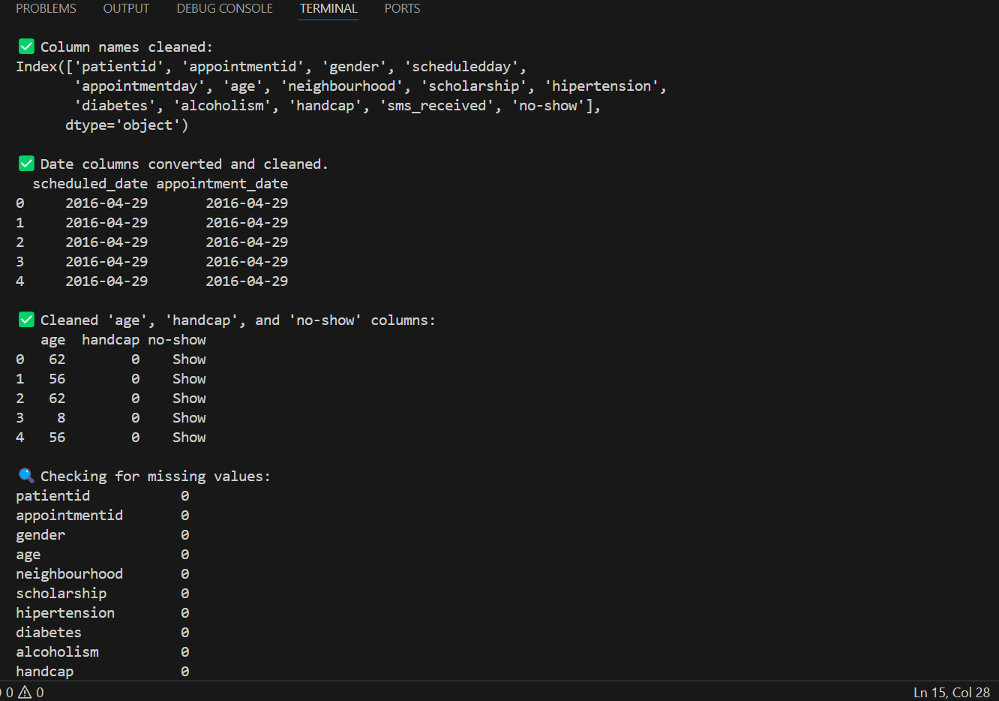

# Task 1: Data Cleaning and Preprocessing

## Dataset Used:
Medical Appointment No-Shows (KaggleV2-May-2016.csv)

## What I Did:
- Cleaned column names
- Converted date columns to YYYY-MM-DD format
- Removed invalid age entries (e.g., age < 0)
- Cleaned the 'handcap' column (values > 1 → 1)
- Renamed 'no-show' values to 'Show' and 'No-Show'
- Checked for missing/null values
- Exported cleaned data to CSV

## Output File:
- cleaned_medical_appointments.csv

## Output Screenshot

Below is the screenshot showing the cleaned column names, date conversions, and cleaned sample data.

## Tools Used:
- Python
- Pandas
